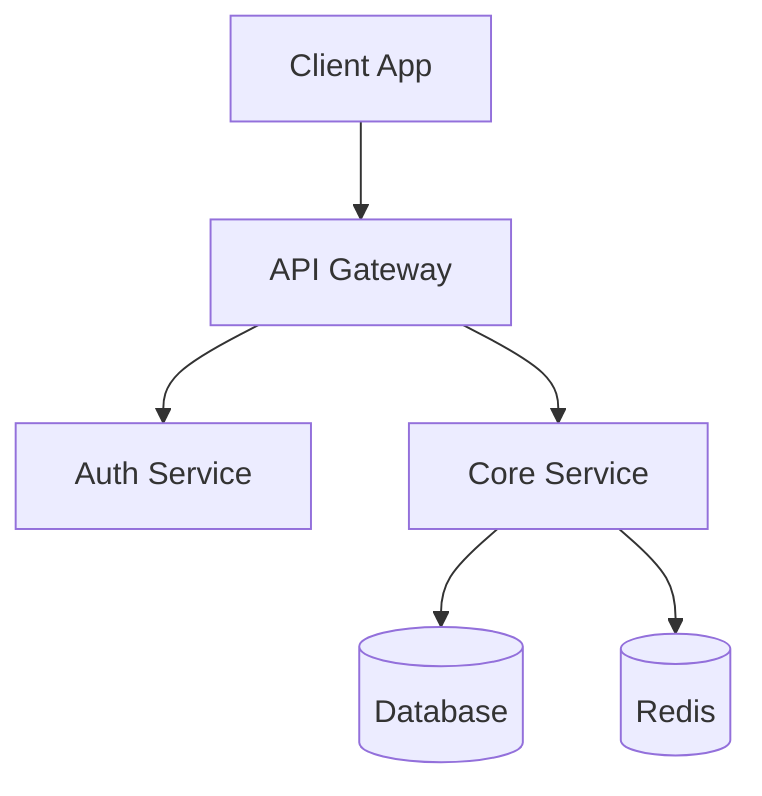

# System Design: [System Name]

## Meta

| Field | Value |
|-------|-------|
| Status | Draft / In Review / Approved |
| Owner | [Name] |
| Reviewers | [Names] |
| Related PRD | `./artifacts/prd_[feature].md` |

## Executive Summary

[2-3 sentences describing what this system does and why it's needed]

## Architecture Overview



## Key Decisions & Trade-offs

| Decision | Choice | Alternatives | Rationale |
|----------|--------|--------------|-----------|
| Database | PostgreSQL | MongoDB, DynamoDB | Relational data, ACID requirements |
| Cache | Redis | Memcached | Rich data types, pub/sub |
| API | REST | GraphQL | Simpler clients, caching |

## Components

### [Component 1]
- **Responsibility**: [What it does]
- **Technology**: [Stack]
- **Scaling**: [How it scales]

### [Component 2]
...

## API Design

### Endpoints
| Method | Path | Description |
|--------|------|-------------|
| GET | /api/v1/resources | List resources |
| POST | /api/v1/resources | Create resource |

## Data Model

```sql
CREATE TABLE resources (
  id UUID PRIMARY KEY,
  name VARCHAR(255) NOT NULL,
  created_at TIMESTAMPTZ DEFAULT NOW()
);
```

## Non-Functional Requirements

| Requirement | Target | Measurement |
|-------------|--------|-------------|
| Availability | 99.9% | Monthly uptime |
| Latency (P95) | <200ms | API response time |
| Throughput | 1000 RPS | Peak load |

## Implementation Plan

1. [ ] Phase 1: Core service MVP
2. [ ] Phase 2: Authentication integration
3. [ ] Phase 3: Caching layer
4. [ ] Phase 4: Monitoring and alerting

## Open Questions

- [ ] [Question 1]
- [ ] [Question 2]
