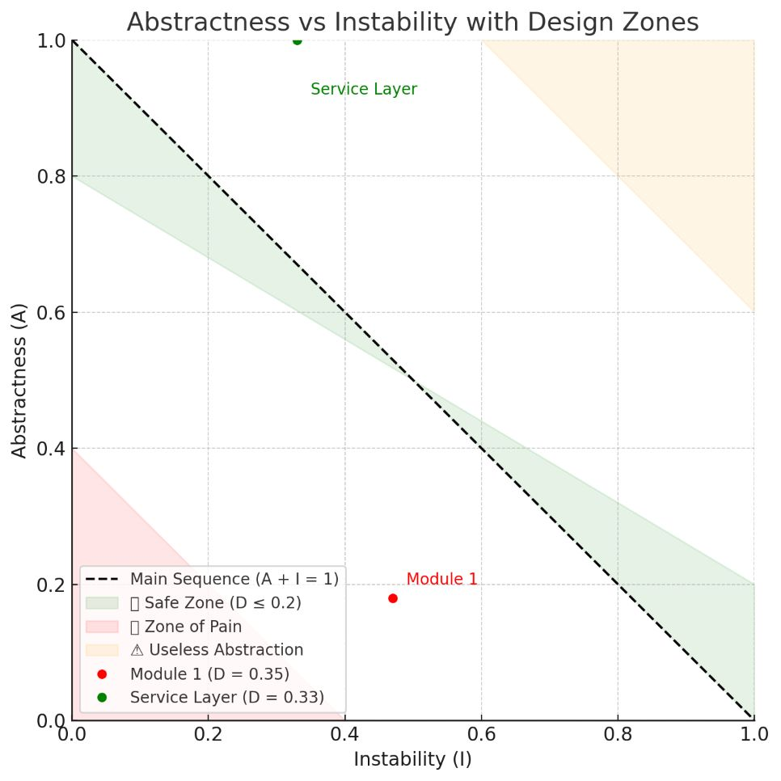

# 📊 Software Architecture & Code Quality Report

**Tool used:** Sonargraph by hello2morrow  
**Scope:** Full project (107 source files, 19 packages, 1 module)  
**Date:** 2025-07-05

---

## ✅ Summary

| Metric | Status |
|--------|--------|
| 🔄 Cyclic Dependencies | ❌ None |
| 🧱 Structural Debt | ❌ 0 (No architectural debt) |
| ♻️ Code Duplicates | ❌ 0 |
| 🧠 Maintainability | ✅ 91.68% |
| 🢿 Avg. Complexity | ✅ 2.09 (Very Low) |
| 🔗 Coupling | ⚠️ Moderate |
| 🔄 Codebase Size | ✅ 4,085 LOC, 107 files |

---

## 📆 Size & Scope

- **Lines of Code (LOC):** 4,085
- **Total Lines:** 5,290
- **Java Packages:** 19
- **Source Files:** 107
- **Types (Classes/Interfaces):** 116

---

## 🔄 Cycle Metrics

| Metric | Value |
|--------|-------|
| Package Cyclicity | 0 |
| Component Cycle Groups | 0 |
| Critically Entangled LOC | 0 |
| Relative Cyclicity | 0.00% |
| Relative Entanglement | 0.00% |

✅ **No cyclic dependencies** in the architecture  
📅 Highly modular and maintainable design.

---

## 🧱 Code Analysis & Structural Quality

| Metric | Value |
|--------|-------|
| Code Duplicates | 0 |
| Redundant Code | 0% |
| Structural Debt Index | 0 |
| Dependencies to Remove | 0 |
| Issue Density | 0.00 |

✅ Clean codebase, no unnecessary dependencies, and no architectural violations.

---

## 🧠 Coupling & Cohesion

| Metric | Value | Notes |
|--------|-------|-------|
| ACD (Average Component Dependency) | 4.20 | ⚠️ Slightly high |
| CCD (Cumulative Component Dependency) | 449 | Acceptable |
| NCCD (Normalized CCD) | 0.72 | ✅ Good (< 1) |
| Propagation Cost | 3.92% | ✅ Low |
| Maintainability Level | 91.68% | ✅ Excellent |

📅 Consider reviewing high fan-out components for better modularity.

---

## 📊 Complexity Metrics

| Metric | Value |
|--------|-------|
| Complex Methods | 0 |
| Avg. Nesting Depth | 0.95 |
| Avg. McCabe Complexity | 2.09 |

🚀 Very low complexity, highly readable and testable code.

---
## 📊 A/I Chart

### Abstractness vs Instability Analysis

#### Overview

This chart is based on principles from *Robert C. Martin* and visualizes the tradeoff between **Abstractness (A)** and **Instability (I)** of each module. It helps assess the internal architecture quality of a system and guides refactoring efforts.

- **Abstractness (A)**: Ratio of abstract classes and interfaces in a module.
- **Instability (I)**: How likely a module is to change (i.e., how many modules depend on it vs how many it depends on).
- **Distance (D)**: Deviation from the "Main Sequence" (ideal balance between A and I), computed as `D = |A + I - 1|`.

#### Zones

The chart is divided into three main zones:

| Zone | Description |
|------|-------------|
| ✅ **Safe Zone** | Modules near the "Main Sequence" (A + I ≈ 1). These have a good balance between abstraction and stability. |
| ❌ **Zone of Pain** | Modules with low A and low I. They are stable but too concrete, making changes risky and expensive. |
| ⚠ **Useless Abstraction Zone** | Modules with high A and high I. Highly abstract but unused, which adds unnecessary complexity. |

#### Example Modules

| Module         | Abstractness (A) | Instability (I) | Distance (D) | Zone                    |
|----------------|------------------|------------------|---------------|--------------------------|
| `app module`   | 0.18             | 0.47             | 0.35          | Near **Zone of Pain**    |
| `service layer`| 1.00             | 0.33             | 0.33          | Slightly **overabstracted** |

#### Recommendations

- Consider refactoring `app module` to extract interfaces or reduce fan-in to reduce architectural debt.
- `service layer` is acceptable, assuming it provides shared contracts, but should be monitored for overengineering.

---

## 📝 Recommendations

- ✅ **Keep current structure**, no major refactors needed.
- 🔍 Monitor ACD and CCD in core components.
- 🔐 Integrate into CI/CD to enforce architectural compliance.
- 📊 Use this report as a baseline for future regressions.

---

## 🗓️ Conclusion

The system shows **excellent code quality and architectural integrity**:

- No cycles
- No duplicates
- Very low complexity
- Maintainability above 90%

> "Clean code, clean architecture, future-proof."

