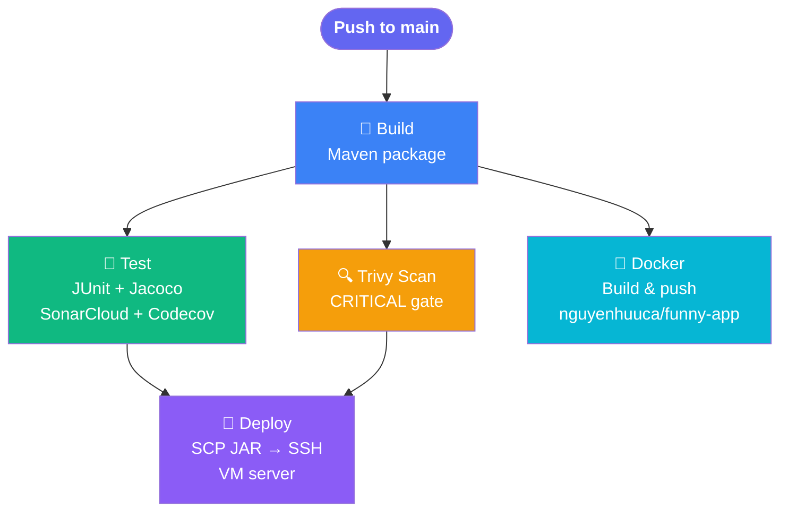

# CI/CD Pipeline Diagram

```mermaid
flowchart TD
    push(["`**Push to main**`"]) --> build

    build["🧱 Build\nMaven package"]

    build --> test
    build --> scan
    build --> docker

    test["🧪 Test\nJUnit + Jacoco\nSonarCloud + Codecov"]
    scan["🔍 Trivy Scan\nCRITICAL gate"]
    docker["🐳 Docker\nBuild & push\nnguyenhuuca/funny-app"]

    test --> deploy
    scan --> deploy

    deploy["🚀 Deploy\nSCP JAR → SSH\nVM server"]

    style push fill:#6366f1,color:#fff
    style build fill:#3b82f6,color:#fff
    style test fill:#10b981,color:#fff
    style scan fill:#f59e0b,color:#fff
    style docker fill:#06b6d4,color:#fff
    style deploy fill:#8b5cf6,color:#fff
```
