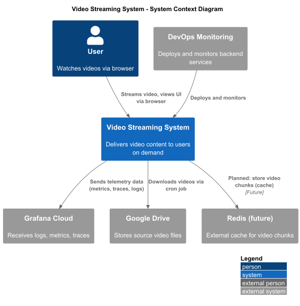
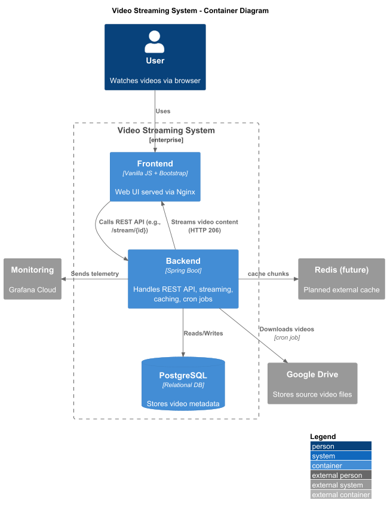
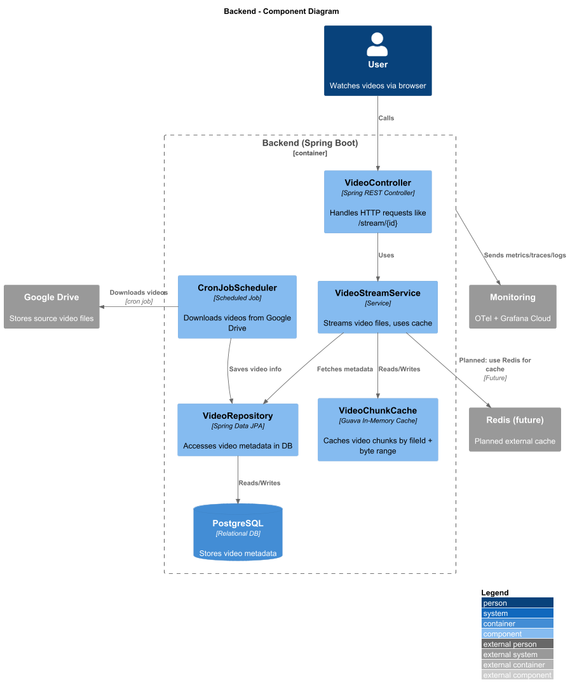
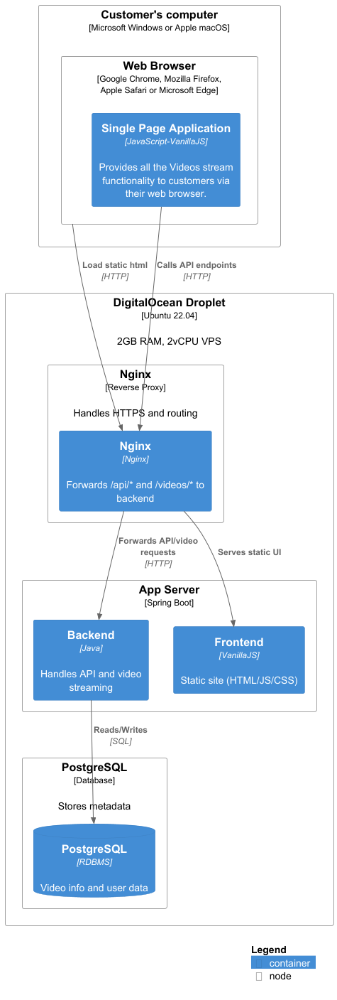
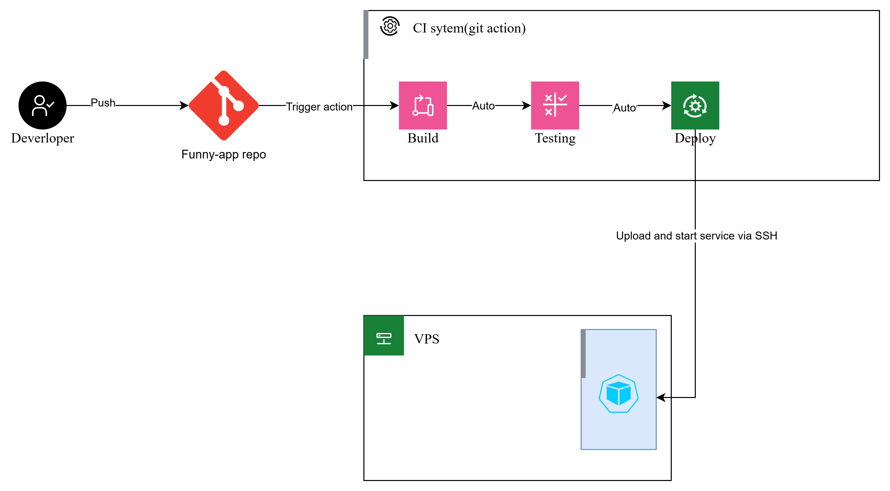
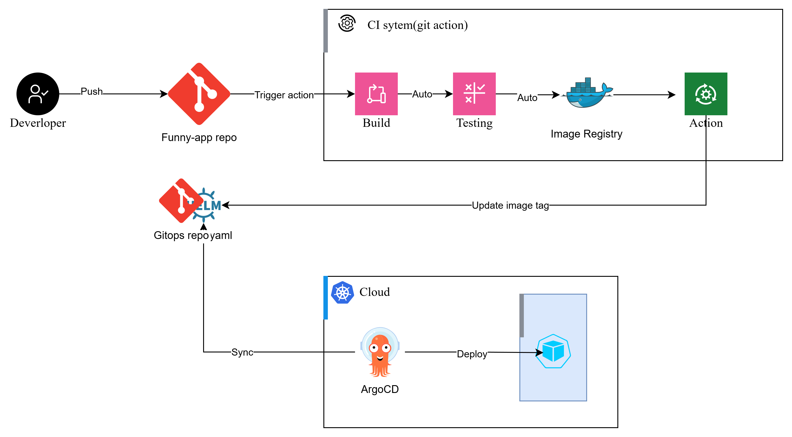
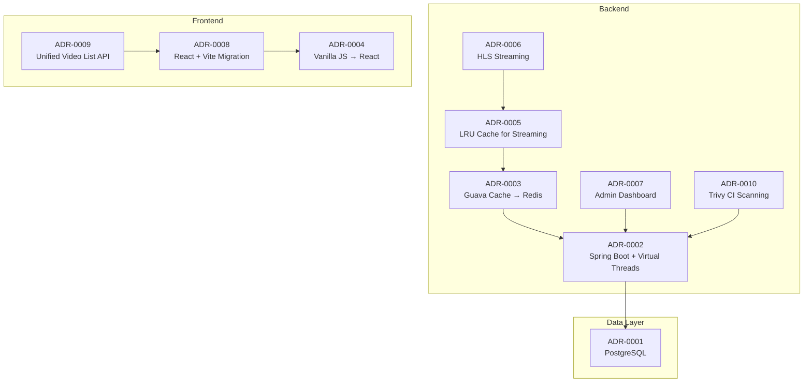

# Video Streaming System Architecture

Date: 2025-07-04  
Status: Accepted  
Authors: Canh  
Deciders: canh-labs  
Supersedes: -  
Superseded-by: -

## Context and Problem Statement

We are building a video streaming system where users can browse and watch videos on demand. The system must handle streaming efficiently, support video metadata management, in-memory caching, background download jobs, and telemetry for monitoring.

We adopt the [C4 Model](https://c4model.com) to document our software architecture in 3 levels: System Context, Container, and Component (for Backend).

---

## Decision Drivers

- Efficient video streaming with support for chunked responses
- Clear separation between frontend/backend/database
- Future-proof design with Redis integration and observability
- Developer onboarding and system clarity

---

## Considered Options

- Express + Node.js (not chosen)
- Monolithic Spring Boot with embedded Tomcat and Virtual Threads ✅
- CDN-based architecture (planned in future)

---

## Decision Outcome

Adopt Spring Boot monolith with clearly defined layers and caching mechanism, and monitor it via OpenTelemetry and Grafana Cloud.

---

## Architecture Overview (C4 Model)

### Level 1 - System Context

---

### Level 2 - Container Diagram

---

### Level 3 - Component Diagram (Backend)

---

### Deployment Diagram

---

### Deployment process (Current CICD) 

---

### Gitops Continuous Deployment Process (Future improvement)

------

## Consequences

- Easy to scale the backend horizontally
- Clear layering improves maintainability
- Video chunk caching can be switched from Guava to Redis later
- Monitoring is decoupled and aligned with observability standards

---

## ✨ Optimizations

* ✅ Uses **virtual threads** for controller to handle concurrent streams efficiently
* ✅ Uses **Guava cache abstraction** to allow future swap to Redis
* ✅ OTEL-compatible tracing enabled via agent `.jar` and `WithSpan` on service methods
* ✅ Metrics collected via `CacheStatsService` for total hits, misses, and per-file stats

---

##  Future Improvements

* Switch to **HLS** or **DASH** for adaptive bitrate
* Upload background jobs to **warm cache** by pre-fetching popular videos
* Support **Redis-based distributed cache** with same `AppCache` abstraction
* Use **async Netty-based streaming** for ultimate IO scalability

---

##  Notes

- Virtual Threads are used in Backend for efficient streaming
- In-memory cache with Guava used until Redis is integrated
- CronJob handles background downloading and database update

---

## Architecture Decision Records (ADR)

The following ADRs record the key decisions made for this system. Each links to the full decision document including context, options considered, and consequences.

| ADR | Title | Status |
|-----|-------|--------|
| [ADR-0001](adr/0001-use-relational-database.md) | Use Relational Database (PostgreSQL) for Core Data | Accepted |
| [ADR-0002](adr/0002-backend-architecture.md) | Use Layered Spring Boot Architecture with Virtual Threads | Accepted |
| [ADR-0003](adr/0003-use-cache.md) | Use Guava Cache Initially, with Planned Migration to Redis | Accepted |
| [ADR-0004](adr/0004-frontend-structure.md) | Use Vanilla JS + Bootstrap with Planned Migration to React | Accepted |
| [ADR-0005](adr/0005-use_lru_cache_video_streaming.md) | Use LRU Cache for Video Streaming | Accepted |
| [ADR-0006](adr/0006-hls-video-streaming.md) | Switch to HLS for Local Video Streaming | Proposed |
| [ADR-0007](adr/0007-admin-dashboard.md) | Admin Dashboard — Content & Account Management | Accepted |
| [ADR-0008](adr/0008-react-migration.md) | Migrate Frontend to React with Vite | Proposed |
| [ADR-0009](adr/0009-unified-video-list-api.md) | Unified Video List API for UI Display | Proposed |
| [ADR-0010](adr/0010-trivy-container-scanning.md) | Add Trivy Dependency & Filesystem Scanning to CI | Accepted |
| [ADR-0011](adr/0011-hot-video-priority.md) | Hot Video Priority Scoring | Accepted |

### Decision Map

The diagram below shows how the ADRs relate to each architectural layer:

