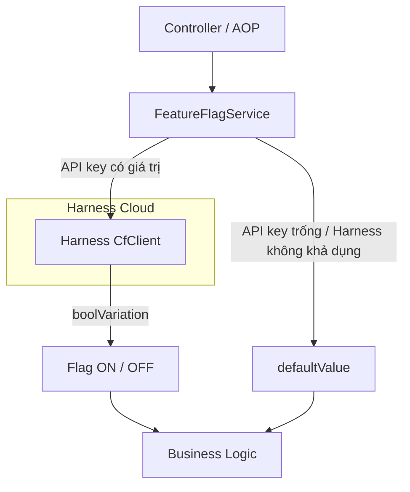
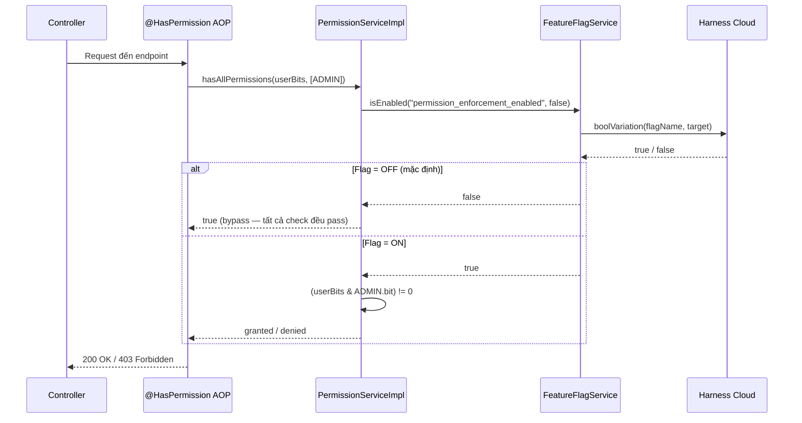

# Harness Feature Flags

Funny Movies tích hợp feature flags thông qua **Harness Feature Flag (FF) SDK** (`ff-java-server-sdk 1.9.3`). Feature flags cho phép bật/tắt tính năng mà không cần deploy lại, đồng thời hỗ trợ rollout từng phần theo từng user.

---

## Kiến trúc tổng quan



**Luồng hoạt động:**

1. Khi Spring Boot khởi động, `FeatureFlagServiceImpl.init()` khởi tạo `CfClient` nếu `FF_API_KEY` được cấu hình.
2. Khi cần kiểm tra flag, `isEnabled(flagName, defaultValue)` được gọi.
3. `CfClient.boolVariation()` liên hệ Harness Cloud với user hiện tại làm `Target`.
4. Nếu Harness không khả dụng, `defaultValue` được trả về — không ném exception.

---

## Cấu hình

**Biến môi trường** (bắt buộc để kích hoạt):

```bash
FF_API_KEY=<your-harness-sdk-key>
```

**`application.yaml`:**

```yaml
harness:
  ff:
    api-key: ${FF_API_KEY:}   # Để trống = tắt hoàn toàn, tất cả flags dùng defaultValue
```

Nếu `FF_API_KEY` trống, toàn bộ flag sẽ fallback về `defaultValue` và ứng dụng tiếp tục hoạt động bình thường.

---

## Service Interface

```java
// FeatureFlagService.java
public interface FeatureFlagService {
    boolean isEnabled(String flag, boolean defaultValue);
}
```

**Cách dùng:**

```java
boolean active = featureFlagService.isEnabled(AppConstant.Flags.MY_FLAG, false);
```

---

## Danh sách Flags hiện tại

Tên các flag được khai báo tập trung tại `AppConstant.Flags`:

| Constant | Tên flag (Harness) | Default | Mô tả |
|---|---|---|---|
| `AppConstant.Flags.PERMISSION_ENFORCEMENT` | `permission_enforcement_enabled` | `false` | Bật kiểm tra bitwise permission. Khi OFF, tất cả permission check đều pass vô điều kiện. |

> **Thêm flag mới:** Khai báo constant trong `AppConstant.Flags`, sau đó tạo flag tương ứng trên Harness console với đúng tên string đó.

---

## User Targeting

Mỗi lần evaluate flag, `FeatureFlagServiceImpl` tự động lấy user hiện tại từ Spring Security context:

```java
private String currentUserId() {
    Authentication auth = SecurityContextHolder.getContext().getAuthentication();
    return (auth != null && auth.isAuthenticated()) ? auth.getName() : "system";
}
```

- **User đã đăng nhập:** `target.identifier` = username / email.
- **Không có session** (batch job, startup task): fallback về `"system"`.

Điều này cho phép cấu hình rollout per-user trên Harness console — ví dụ bật flag cho `admin@example.com` trước khi rollout đại trà.

---

## Ví dụ thực tế: Permission Enforcement

Flag `permission_enforcement_enabled` kiểm soát toàn bộ hệ thống bitwise permission.



**Permission bits (enum `Permission`):**

| Permission | Bit | Giá trị |
|---|---|---|
| `READ` | `1 << 0` | 1 |
| `WRITE` | `1 << 1` | 2 |
| `EXEC` | `1 << 2` | 4 |
| `DELETE` | `1 << 3` | 8 |
| `ADMIN` | `1 << 4` | 16 |

User với `permissions = 17` (binary `10001`) có `READ` + `ADMIN`.

---

## Graceful Degradation

| Tình huống | Kết quả |
|---|---|
| `FF_API_KEY` trống | Log info, bỏ qua init, trả `defaultValue` cho tất cả flags |
| Harness không khả dụng khi startup | Log warning, `cfClient` vẫn được tạo, tiếp tục retry |
| `cfClient == null` | `isEnabled()` trả về `defaultValue` ngay lập tức |
| Flag chưa được tạo trên Harness | `boolVariation()` trả về `defaultValue` |

Ứng dụng **không bao giờ crash** vì Harness không khả dụng. Mọi lỗi đều fallback về giá trị mặc định.

---

## Thêm một Flag mới

**Bước 1 — Khai báo constant:**

```java
// AppConstant.java
public static class Flags {
    public static final String PERMISSION_ENFORCEMENT = "permission_enforcement_enabled";
    public static final String MY_NEW_FEATURE = "my_new_feature_enabled"; // thêm ở đây
}
```

**Bước 2 — Sử dụng trong service:**

```java
@Autowired
private FeatureFlagService featureFlagService;

public void doSomething() {
    if (featureFlagService.isEnabled(AppConstant.Flags.MY_NEW_FEATURE, false)) {
        // logic mới
    } else {
        // logic cũ / fallback
    }
}
```

**Bước 3 — Tạo flag trên Harness console:**

1. Vào **Harness → Feature Flags → New Flag**.
2. Tên flag phải khớp chính xác với constant string: `my_new_feature_enabled`.
3. Chọn type: **Boolean**.
4. Cấu hình default rules và rollout targeting.

---

## Test Coverage

| Test Class | Số test | Phạm vi |
|---|---|---|
| `FeatureFlagServiceImplTest` | 11 | Init, degradation, security context resolution |
| `PermissionServiceImplTest` | 20 | Flag ON/OFF, bitwise operations |
| `HasPermissionAnnotationTest` | 24 | AOP chain, SpEL, integration |
| `AdminControllerPermissionTest` | 9 | HTTP 200/403, flag bypass |

---

## Các file liên quan

| File | Vai trò |
|---|---|
| `service/FeatureFlagService.java` | Service interface |
| `service/impl/FeatureFlagServiceImpl.java` | Tích hợp Harness CfClient |
| `service/impl/PermissionServiceImpl.java` | Consumer: permission enforcement gate |
| `utils/AppConstant.java` → inner class `Flags` | Tập trung khai báo tên flag |
| `aop/HasPermission.java` | Annotation `@HasPermission` cho endpoints |
| `filter/WebSecurityConfig.java` | Spring Security + SpEL expression handler |
| `application.yaml` (`harness.ff.api-key`) | Cấu hình API key |
| `pom.xml` (`ff-java-server-sdk 1.9.3`) | Maven dependency |
