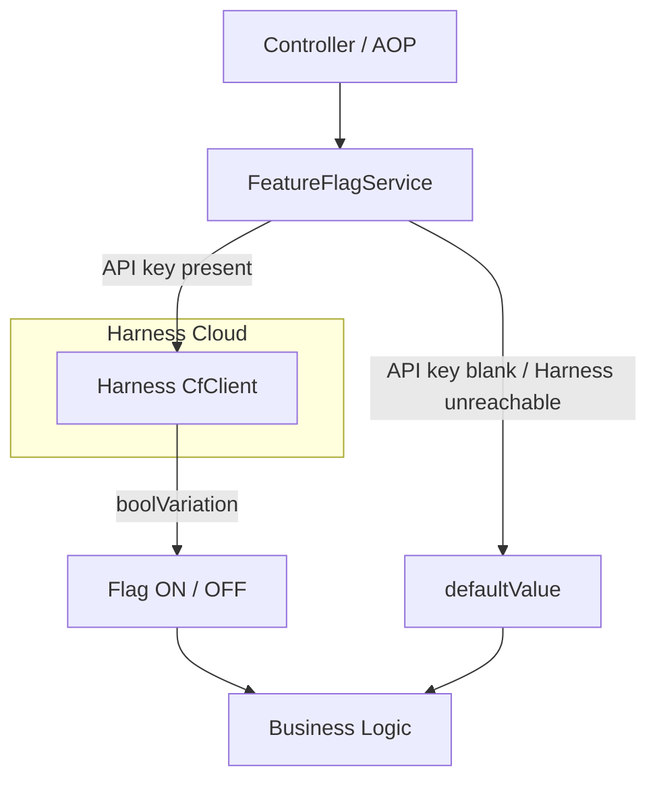
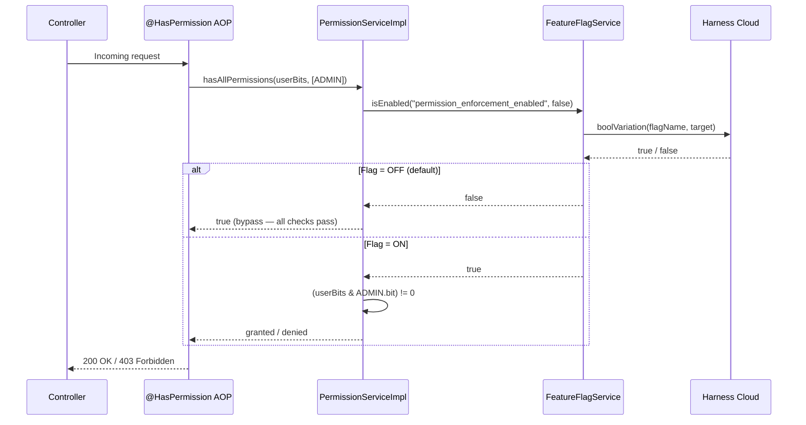

# Harness Feature Flags

Funny Movies integrates feature flags via the **Harness Feature Flag (FF) SDK** (`ff-java-server-sdk 1.9.3`). Flags allow enabling or disabling features without redeploying, and support per-user gradual rollouts.

---

## Architecture Overview



**Flow:**

1. On Spring Boot startup, `FeatureFlagServiceImpl.init()` initializes `CfClient` if `FF_API_KEY` is configured.
2. When a flag check is needed, `isEnabled(flagName, defaultValue)` is called.
3. `CfClient.boolVariation()` contacts Harness Cloud using the current user as the `Target`.
4. If Harness is unavailable, `defaultValue` is returned — no exceptions thrown.

---

## Configuration

**Environment variable** (required to activate):

```bash
FF_API_KEY=<your-harness-sdk-key>
```

**`application.yaml`:**

```yaml
harness:
  ff:
    api-key: ${FF_API_KEY:}   # Blank = disabled, all flags use defaultValue
```

If `FF_API_KEY` is empty, all flags fall back to `defaultValue` and the application continues normally.

---

## Service Interface

```java
// FeatureFlagService.java
public interface FeatureFlagService {
    boolean isEnabled(String flag, boolean defaultValue);
}
```

**Usage:**

```java
boolean active = featureFlagService.isEnabled(AppConstant.Flags.MY_FLAG, false);
```

---

## Current Flags

Flag name constants are centralized in `AppConstant.Flags`:

| Constant | Flag Name (Harness) | Default | Description |
|---|---|---|---|
| `AppConstant.Flags.PERMISSION_ENFORCEMENT` | `permission_enforcement_enabled` | `false` | Enables bitwise permission enforcement. When OFF, all permission checks pass unconditionally. |

> **Adding a new flag:** Declare a constant in `AppConstant.Flags`, then create a matching flag on the Harness console with the exact same name string.

---

## User Targeting

Every flag evaluation automatically resolves the current user from the Spring Security context:

```java
private String currentUserId() {
    Authentication auth = SecurityContextHolder.getContext().getAuthentication();
    return (auth != null && auth.isAuthenticated()) ? auth.getName() : "system";
}
```

- **Authenticated user:** `target.identifier` = username / email.
- **No active session** (batch jobs, startup tasks): falls back to `"system"`.

This enables per-user rollouts on the Harness console — for example, enabling a flag for `admin@example.com` before a full rollout.

---

## Example: Permission Enforcement

The `permission_enforcement_enabled` flag gates the entire bitwise permission system.



**Permission bits (`Permission` enum):**

| Permission | Bit | Value |
|---|---|---|
| `READ` | `1 << 0` | 1 |
| `WRITE` | `1 << 1` | 2 |
| `EXEC` | `1 << 2` | 4 |
| `DELETE` | `1 << 3` | 8 |
| `ADMIN` | `1 << 4` | 16 |

A user with `permissions = 17` (binary `10001`) holds `READ` + `ADMIN`.

---

## Graceful Degradation

| Scenario | Behavior |
|---|---|
| `FF_API_KEY` is blank | Logs info, skips init, returns `defaultValue` for all flags |
| Harness unreachable at startup | Logs warning, `cfClient` still created, continues retrying |
| `cfClient == null` | `isEnabled()` returns `defaultValue` immediately |
| Flag not created on Harness | `boolVariation()` returns `defaultValue` |

The application **never crashes** due to Harness being unavailable. All errors fall back to the configured default.

---

## Adding a New Flag

**Step 1 — Declare the constant:**

```java
// AppConstant.java
public static class Flags {
    public static final String PERMISSION_ENFORCEMENT = "permission_enforcement_enabled";
    public static final String MY_NEW_FEATURE = "my_new_feature_enabled"; // add here
}
```

**Step 2 — Use it in a service:**

```java
@Autowired
private FeatureFlagService featureFlagService;

public void doSomething() {
    if (featureFlagService.isEnabled(AppConstant.Flags.MY_NEW_FEATURE, false)) {
        // new behavior
    } else {
        // existing / fallback behavior
    }
}
```

**Step 3 — Create the flag on the Harness console:**

1. Go to **Harness → Feature Flags → New Flag**.
2. The flag name must exactly match the constant string: `my_new_feature_enabled`.
3. Set type to **Boolean**.
4. Configure default rules and rollout targeting.

---

## Test Coverage

| Test Class | Tests | Scope |
|---|---|---|
| `FeatureFlagServiceImplTest` | 11 | Init, degradation, security context resolution |
| `PermissionServiceImplTest` | 20 | Flag ON/OFF, bitwise operations |
| `HasPermissionAnnotationTest` | 24 | AOP chain, SpEL, integration |
| `AdminControllerPermissionTest` | 9 | HTTP 200/403, flag bypass |

---

## Related Files

| File | Role |
|---|---|
| `service/FeatureFlagService.java` | Service interface |
| `service/impl/FeatureFlagServiceImpl.java` | Harness CfClient integration |
| `service/impl/PermissionServiceImpl.java` | Consumer: permission enforcement gate |
| `utils/AppConstant.java` → inner class `Flags` | Centralized flag name constants |
| `aop/HasPermission.java` | `@HasPermission` annotation for endpoints |
| `filter/WebSecurityConfig.java` | Spring Security + SpEL expression handler |
| `application.yaml` (`harness.ff.api-key`) | API key configuration |
| `pom.xml` (`ff-java-server-sdk 1.9.3`) | Maven dependency |
