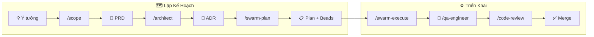

# Từ Ý Tưởng Đến Triển Khai — Quy Trình Claude

Tài liệu này mô tả quy trình đầu-cuối để đưa một ý tưởng tính năng thô thành code đã được merge và kiểm thử, sử dụng các lệnh và template của Claude.

---

## Tổng Quan



| Bước | Lệnh | Output | Template |
|------|------|--------|----------|
| 1. Scope | `/scope` | `docs/prd/PRD-{slug}.md` | `templates/artifacts/prd.template.md` |
| 2. Kiến trúc | `/architect` | `docs/adr/NNNN-{slug}.md` | `templates/artifacts/adr.template.md` |
| 3. Kế hoạch | `/swarm-plan` | `docs/plans/plan-{slug}.md` + Beads | `templates/artifacts/plan.template.md` |
| 4. Triển khai | `/swarm-execute` hoặc `/builder` | Code changes | — |
| 5. Kiểm thử | `/qa-engineer` | Test files | — |
| 6. Review | `/code-review` | Findings | — |

---

## Bước 1 — Scope ý tưởng thành PRD

Bắt đầu với bất kỳ mô tả nào, dù còn mơ hồ. Claude sẽ hỏi làm rõ trước khi viết.

```
/scope thêm phần bình luận vào trang video
```

Claude hỏi **từng câu một**, theo thứ tự:

1. Tính năng này giải quyết vấn đề gì? Ai gặp vấn đề đó?
2. Người dùng chính là ai?
3. Đo lường thành công như thế nào?
4. V1 bao gồm những gì?
5. Những gì rõ ràng nằm ngoài phạm vi?
6. Có ràng buộc kỹ thuật nào đã biết không?

Sau mỗi câu trả lời, Claude xác nhận ngắn gọn rồi hỏi câu tiếp theo. Khi đã đủ thông tin, Claude tóm tắt và xác nhận trước khi viết.

Sau cuộc hội thoại, Claude:
1. Đọc code hiện có liên quan qua Grep/Glob
2. Viết `docs/prd/PRD-comment-section.md` theo `templates/artifacts/prd.template.md`
3. Đề xuất tạo ADR và Plan

**Output:** `docs/prd/PRD-{slug}.md`

---

## Bước 2 — Quyết định kiến trúc (ADR)

Sau khi PRD được duyệt, chạy `/architect` để đưa ra và ghi lại các quyết định kỹ thuật quan trọng.

```
/architect docs/prd/PRD-comment-section.md
```

Claude sẽ:
1. Đọc PRD
2. Xác định các quyết định kiến trúc chính (data model, API design, caching strategy, v.v.)
3. Nghiên cứu codebase hiện có để tìm ràng buộc
4. Dùng Sequential Thinking để phân tích trade-off
5. Viết `docs/adr/NNNN-comment-section.md` theo `templates/artifacts/adr.template.md`

ADR bao gồm:
- **Considered Options** — ít nhất 2–3 phương án với bảng Pros/Cons
- **Decision Outcome** — phương án được chọn + lý do + tác động định lượng
- **Consequences** — tích cực, tiêu cực, rủi ro

> **Quy tắc:** Mỗi ADR cho một quyết định lớn. Nếu một tính năng có nhiều quyết định độc lập (ví dụ: data model + caching strategy), tạo nhiều ADR riêng biệt.

**Output:** `docs/adr/NNNN-{slug}.md`

---

## Bước 3 — Kế hoạch triển khai

Sau khi PRD + ADR được duyệt, dùng `/swarm-plan` để phân rã tính năng thành kế hoạch theo giai đoạn và Beads.

```
/swarm-plan docs/prd/PRD-comment-section.md docs/adr/NNNN-comment-section.md
```

`/swarm-plan` khác `/architect` ở chỗ:

| | `/architect` | `/swarm-plan` |
|---|---|---|
| **Output chính** | ADR (ghi lại quyết định) | Plan + Beads (chia nhỏ task) |
| **Hỏi người dùng** | Không — tự explore codebase | Không — đọc PRD/ADR |
| **Tạo ADR** | Luôn luôn | Chỉ khi gặp quyết định One-Way Door (High) |
| **Tạo Beads** | Không | Có — sẵn sàng cho `/swarm-execute` |

`/swarm-plan` sẽ:
1. Spawn 3–6 `worker-explorer` agents song song để nghiên cứu patterns hiện có
2. Phân loại khả năng đảo ngược (Two-Way Door vs One-Way Door)
3. Viết `docs/plans/plan-{slug}.md` theo `templates/artifacts/plan.template.md`
4. Output Beads commands cho tất cả tasks với dependency graph

Kế hoạch bao gồm:
- Các bước theo giai đoạn với đường dẫn file chính xác và acceptance criteria
- Chiến lược kiểm thử (unit + integration + manual)
- Kế hoạch rollback
- Dependency graph thể hiện thứ tự tasks
- Checklist trước/trong/sau PR

**Output:** `docs/plans/plan-{slug}.md` + Beads

---

## Bước 4 — Triển khai

### Lựa chọn A — Builder đơn lẻ (task nhỏ/vừa)

```
/builder implement docs/plans/plan-comment-section.md
```

Builder sẽ:
1. Đọc plan, PRD, và ADR
2. Đọc patterns code hiện có qua Grep/Glob trước khi viết
3. Triển khai từng giai đoạn
4. Viết tests song song với code (TDD)
5. Chạy `mvn verify` hoặc `npm run test` để xác nhận pass

### Lựa chọn B — Swarm (task lớn/song song)

```
/swarm-execute docs/plans/plan-comment-section.md
```

Swarm sẽ:
1. Phân rã plan thành các track song song (ví dụ: backend + frontend + tests)
2. Spawn nhiều `worker-builder` agents cùng lúc
3. Mỗi worker xử lý một track
4. Orchestrator tích hợp và giải quyết xung đột

Dùng swarm khi plan có 3+ giai đoạn độc lập có thể chạy song song.

**Output:** Code commits trên feature branch

---

## Bước 5 — Kiểm thử

```
/qa-engineer test the comment section feature
```

QA engineer sẽ:
1. Review implementation theo PRD acceptance criteria
2. Viết unit tests còn thiếu
3. Viết integration tests cho happy path và edge cases
4. Kiểm tra test isolation (không có shared state, không phụ thuộc thứ tự)

Chạy thủ công để xác nhận:
```bash
cd api && mvn verify          # backend
cd webapp && npm run test     # frontend
```

**Output:** Test files, báo cáo coverage

---

## Bước 6 — Review

```
/code-review
```

Hoặc review đa chiều sâu hơn:

```
/swarm-review
```

Reviewer kiểm tra:
- Tính đúng đắn — lỗi logic, edge cases bị bỏ sót
- Bảo mật — OWASP Top 10, input validation, auth/authz
- Hiệu năng — N+1 queries, blocking I/O, thiếu index
- Chất lượng code — SOLID, DRY, đặt tên, độ phủ test

Sửa các phát hiện, rồi commit và mở PR.

---

## Ví dụ đầy đủ — end to end

```bash
# 1. Scope
/scope thêm real-time view count vào video cards

# Claude hỏi từng câu → bạn trả lời → PRD được tạo
# → docs/prd/PRD-realtime-view-count.md

# 2. Kiến trúc
/architect docs/prd/PRD-realtime-view-count.md

# Dùng Sequential Thinking để phân tích trade-off
# → docs/adr/0013-realtime-view-count.md

# 3. Kế hoạch
/swarm-plan docs/prd/PRD-realtime-view-count.md docs/adr/0013-realtime-view-count.md

# Spawn explorer agents song song → nghiên cứu codebase
# → docs/plans/plan-realtime-view-count.md + Beads

# 4. Triển khai
git checkout -b feat/realtime-view-count
/swarm-execute docs/plans/plan-realtime-view-count.md

# 5. Kiểm thử
/qa-engineer test view count feature
cd api && mvn verify
cd webapp && npm run test

# 6. Review
/code-review

# 7. Commit và push
git add .
git commit -m "feat: add real-time view count to video cards"
git push
```

---

## Khi nào bỏ qua bước

| Tình huống | Bỏ qua |
|------------|--------|
| Bug fix < 1 ngày | Bỏ PRD, ADR, Plan — vào thẳng `/builder` |
| Cập nhật config/dependency | Bỏ PRD, ADR — chỉ tạo Plan nếu không tầm thường |
| Refactor nhỏ | Bỏ PRD, ADR — dùng `/simplify` trực tiếp |
| Tính năng mới > 3 ngày | Chạy đủ các bước |
| Thay đổi kiến trúc breaking | Chạy đủ, nhấn mạnh ADR |

---

## Vị trí artifacts

```
docs/
├── prd/          → PRD-{feature}.md
├── adr/          → NNNN-{decision}.md
└── plans/        → plan-{feature}.md

templates/artifacts/
├── prd.template.md
├── adr.template.md
└── plan.template.md
```

---

## Liên quan

- [Hướng dẫn Claude (Tiếng Anh)](claude-guide-en.md)
- [Hướng dẫn Claude (Tiếng Việt)](claude-guide-vi.md)
- [Danh sách ADR](README.md#-design-decisions)
- [Bản tiếng Anh](flow-scope-to-implement.md)
