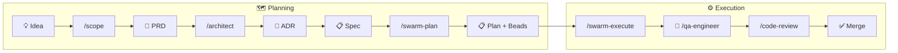

# From Idea to Implementation — Claude Workflow

This document describes the end-to-end flow for taking a rough feature idea all the way to merged, tested code using Claude commands and templates.

---

## Overview



| Step | Command | Output | Template |
|------|---------|--------|----------|
| 1. Scope | `/scope` | `docs/prd/PRD-{slug}.md` | `templates/artifacts/prd.template.md` |
| 2. Architecture | `/architect` | `docs/adr/NNNN-{slug}.md` | `templates/artifacts/adr.template.md` |
| 3. Spec | `/spec` | `docs/specs/spec-{slug}.md` | `templates/artifacts/spec.template.md` |
| 4. Plan | `/swarm-plan` | `docs/plans/plan-{slug}.md` + Beads | `templates/artifacts/plan.template.md` |
| 5. Implement | `/swarm-execute` or `/builder` | Code changes | — |
| 6. Test | `/qa-engineer` | Test files | — |
| 7. Review | `/code-review` | Findings | — |

---

## Step 1 — Scope the idea into a PRD

Start with any rough description. Claude will ask clarifying questions before writing.

```
/scope add a comment section to video pages
```

Claude asks questions **one at a time**, working through:

1. What problem does this solve? Who has this pain?
2. Who are the primary users?
3. How will we measure success?
4. What is explicitly in scope for v1?
5. What is explicitly out of scope?
6. Any known technical constraints?

After each answer Claude briefly acknowledges it, then asks the next question. Once all gaps are filled, Claude summarizes its understanding and confirms before writing.

After the conversation, Claude:
1. Reads relevant existing code via Grep/Glob
2. Writes `docs/prd/PRD-comment-section.md` using `templates/artifacts/prd.template.md`
3. Offers to create an ADR and Plan

**Output:** `docs/prd/PRD-{slug}.md`

---

## Step 2 — Architecture decision (ADR)

Once the PRD is approved, run `/architect` to make and record the key technical decisions.

```
/architect review docs/prd/PRD-comment-section.md and create an ADR
```

Claude:
1. Reads the PRD
2. Identifies the key architectural decisions (data model, API design, caching strategy, etc.)
3. Researches the existing codebase for constraints
4. Writes `docs/adr/NNNN-comment-section.md` using `templates/artifacts/adr.template.md`

The ADR contains:
- **Considered Options** — at least 2–3 alternatives with Pros/Cons tables
- **Decision Outcome** — chosen option + rationale + quantified impact
- **Consequences** — positive, negative, risks

> **Rule:** One ADR per major decision. If a feature has multiple independent decisions (e.g., data model + caching strategy), create multiple ADRs.

**Output:** `docs/adr/NNNN-{slug}.md`

---

## Step 3 — Feature Specification (Spec)

With the ADR approved, write a Spec that translates architectural decisions into an exact, unambiguous contract for developers and QA.

Run `/spec` with the PRD and ADR as inputs — it reads both files, asks clarifying questions one at a time, then writes the Spec.

```
/spec docs/prd/PRD-comment-section.md docs/adr/NNNN-comment-section.md
```

### What goes in a Spec

| Section | Purpose |
|---------|---------|
| **Business Rules** | Numbered, precise rules. Each rule is independently testable. |
| **Functional Requirements** | What the system must do (FR-1, FR-2...). Use "must", "must not". |
| **API Changes** | Exact endpoint, request body, response body, all error codes and conditions. |
| **Database Changes** | Final SQL schema — tables, columns, indexes, constraints. |
| **Security Requirements** | Which endpoints require JWT. Role checks. Fields to mask in logs. |
| **Edge Cases** | EC-1, EC-2... — every non-obvious scenario with exact expected behavior. |
| **Acceptance Criteria** | Testable checklist. QA uses this directly. |

### Example

```markdown
## Business Rules

### Rule 1
A user may post at most 10 comments per video per day.

### Rule 2
Deleted comments are soft-deleted — content replaced with "[deleted]", replies remain.

## Edge Cases

### EC-1: User posts 10th comment
Expected: Success (201)

### EC-2: User posts 11th comment same day
Expected: Reject — HTTP 429, code: COMMENT_LIMIT_EXCEEDED

### EC-3: Two requests from same user arrive simultaneously
Expected: At most one succeeds; limit remains enforced
```

### When to skip Spec

| Scenario | Skip? |
|----------|-------|
| Bug fix | ✅ Skip — go straight to Plan |
| Feature < 1 day | ✅ Skip |
| Feature with backend + frontend in parallel | ❌ Required — Spec is the shared contract |
| Feature > 3 days | ❌ Required |
| Any ambiguous business rules | ❌ Required |

**Output:** `docs/specs/spec-{slug}.md`

---

## Step 4 — Implementation plan

With PRD + ADR approved, use `/swarm-plan` to decompose the feature into a phased plan and Beads.

```
/swarm-plan docs/prd/PRD-comment-section.md docs/adr/NNNN-comment-section.md
```

`/swarm-plan` differs from `/architect`:

| | `/architect` | `/swarm-plan` |
|---|---|---|
| **Primary output** | ADR (decision record) | Plan + Beads (task breakdown) |
| **Asks questions** | No — explores codebase | No — reads PRD/ADR |
| **Creates ADR** | Always | Only for One-Way Door (High) decisions found during planning |
| **Creates Beads** | No | Yes — ready for `/swarm-execute` |

`/swarm-plan` will:
1. Launch 3–6 `worker-explorer` agents in parallel to research existing patterns
2. Classify decision reversibility (Two-Way Door vs One-Way Door)
3. Write `docs/plans/plan-{slug}.md` using `templates/artifacts/plan.template.md`
4. Output Beads commands for all implementation tasks with dependencies

The plan contains:
- Phased steps with exact file paths and acceptance criteria
- Testing strategy (unit + integration + manual)
- Rollback plan
- Dependency graph showing task order
- Before/During/After PR checklist

**Output:** `docs/plans/plan-{slug}.md` + Beads

---

## Step 5 — Implement

### Option A — Single builder (small/medium tasks)

```
/builder implement docs/plans/plan-comment-section.md
```

The builder:
1. Reads the plan, PRD, and ADR
2. Reads existing code patterns via Grep/Glob before writing
3. Implements phase by phase
4. Writes tests alongside code (TDD)
5. Runs `mvn verify` or `npm run test` to confirm passing

### Option B — Swarm (large/parallel tasks)

```
/swarm-execute implement docs/plans/plan-comment-section.md
```

The swarm:
1. Decomposes the plan into parallel tracks (e.g., backend + frontend + tests)
2. Spawns multiple `worker-builder` agents simultaneously
3. Each worker handles one track
4. Orchestrator integrates and resolves conflicts

Use swarm when the plan has 3+ independent phases that can run in parallel.

**Output:** Code commits on a feature branch

---

## Step 6 — Test

```
/qa-engineer test the comment section feature
```

QA engineer:
1. Reviews the implementation against PRD acceptance criteria
2. Writes missing unit tests
3. Writes integration tests for the happy path and edge cases
4. Checks test isolation (no shared state, no order-dependent tests)

Run tests manually to confirm:
```bash
cd api && mvn verify          # backend
cd webapp && npm run test     # frontend
```

**Output:** Test files, coverage report

---

## Step 7 — Review

```
/code-review
```

Or for a deeper multi-perspective review:

```
/swarm-review
```

The reviewer checks:
- Correctness — logic errors, edge cases missed
- Security — OWASP Top 10, input validation, auth/authz
- Performance — N+1 queries, blocking I/O, missing indexes
- Code quality — SOLID, DRY, naming, test coverage

Fix findings, then commit and open a PR.

---

## Full example — end to end

```bash
# 1. Scope
/scope add real-time view count to video cards

# Claude asks questions one at a time → you answer → PRD created
# → docs/prd/PRD-realtime-view-count.md

# 2. Architecture
/architect docs/prd/PRD-realtime-view-count.md

# Uses Sequential Thinking for trade-off analysis
# → docs/adr/0013-realtime-view-count.md

# 3. Spec
/spec docs/prd/PRD-realtime-view-count.md docs/adr/0013-realtime-view-count.md

# → docs/specs/spec-realtime-view-count.md

# 4. Plan
/swarm-plan docs/prd/PRD-realtime-view-count.md docs/adr/0013-realtime-view-count.md

# Launches parallel explorer agents → researches codebase
# → docs/plans/plan-realtime-view-count.md + Beads

# 4. Implement
git checkout -b feat/realtime-view-count
/swarm-execute docs/plans/plan-realtime-view-count.md

# 5. Test
/qa-engineer test view count feature
cd api && mvn verify
cd webapp && npm run test

# 6. Review
/code-review

# 7. Commit and push
git add .
git commit -m "feat: add real-time view count to video cards"
git push
```

---

## When to skip steps

| Scenario | Skip |
|----------|------|
| Bug fix < 1 day | Skip PRD, ADR, Plan — go straight to `/builder` |
| Config / dependency update | Skip PRD, ADR — create Plan only if non-trivial |
| Small refactor | Skip PRD, ADR — use `/simplify` directly |
| New feature > 3 days | Run all steps |
| Breaking architectural change | Run all steps, extra emphasis on ADR |

---

## Artifacts location reference

```
docs/
├── prd/          → PRD-{feature}.md
├── adr/          → NNNN-{decision}.md
├── specs/        → spec-{feature}.md
└── plans/        → plan-{feature}.md

templates/artifacts/
├── prd.template.md
├── adr.template.md
├── spec.template.md
└── plan.template.md
```

---

## Related

- [Claude Guide (English)](claude-guide-en.md)
- [Claude Guide (Vietnamese)](claude-guide-vi.md)
- [ADR Index](README.md#-design-decisions)
