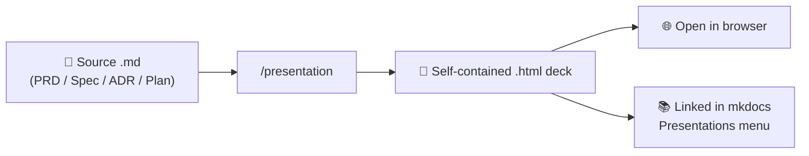

# Presentation Command — Render docs into HTML decks

The `/presentation` command (and the matching `presentation` skill) turns **one**
markdown document — a **PRD**, **Spec**, **ADR**, or **Plan** — into **one**
self-contained, full-screen HTML slide deck that opens directly in any browser.

It is **render-only**: it never adds, drops, or reinterprets content. The slides
always stay faithful to the source document, so they never drift from the spec.

---

## When to use it

Use it whenever you need to **present a document to stakeholders** without
copying content into a slide tool by hand:

- Walk product/business stakeholders through a PRD (problem → goals → scope).
- Present a technical decision (ADR) or feature spec to engineers.
- Review an implementation plan and its phases/estimates.

```
/presentation docs/prd/PRD-hot-video-priority.md
/presentation docs/specs/spec-watch-history.md
/presentation docs/adr/0006-hls-video-streaming.md
/presentation docs/plans/plan-bookmark-feature.md
```

If you run `/presentation` with no path, Claude asks for one. Defaults live in
`docs/prd/`, `docs/specs/`, `docs/adr/`, and `docs/plans/`.

---

## Overview



| In | Out |
|----|-----|
| One markdown file (PRD / Spec / ADR / Plan) | One `.html` file — a tab-bar slide deck |

---

## How it works

1. **Detect type** — from the title / `## Metadata` / heading shape:

   | Type | Detected by |
   |------|-------------|
   | **PRD** | `# PRD:` or `## Problem Statement` + `## Goals & Success Metrics` + `## User Stories` |
   | **Spec** | `# Feature Specification:` or `## Functional Requirements` |
   | **ADR** | `# ADR-` / `## Decision Drivers` / `## Considered Options` |
   | **Plan** | `# Plan:` / `## Implementation Steps` / `### Phase N` |

2. **Copy the template** — `.claude/skills/design/presentation/template-tabbar.html`
   (dark theme, sticky tab bar, MathJax for formulas). No new CSS is invented.

3. **Fill the header** — eyebrow = type + id, `<h1>` = title, chips = Status /
   Date / Owner / Version from `## Metadata`.

4. **Map each section to a tab** — one `.tab-btn` + matching `.panel` per major
   section (type-specific maps below).

5. **Fill panels with color-coded cards**, keeping tables, code, and diagrams
   verbatim; long rationale goes inside collapsible `🔎 Details`.

---

## Tab maps by document type

| Type | Tabs |
|------|------|
| **PRD** | 🎯 Overview · ❓ Problem · 📈 Goals & Metrics · 👤 User Stories · ✅ Requirements · 🧭 Scope · 🔗 Dependencies · ⚠️ Risks |
| **Spec** | 🎯 Overview · 📐 Business Rules · ✅ Requirements (FR-*) · 🔌 API Changes · 🗄️ Data / DB · 🔒 Security · 🧪 Testing |
| **ADR** | 📌 Context · 🎚️ Drivers · ⚖️ Options · ✅ Decision · 📊 Consequences · 🔗 Links |
| **Plan** | 🎯 Objective · 🧭 Scope · 🏗️ Approach · 🪜 Phases · 📁 Files · ⚠️ Risks |

Only sections that exist in the source are rendered.

### Color conventions

| Meaning | Block |
|---------|-------|
| Goal / overview / primary path | `.card.blue`, `.hl.goal` |
| Chosen / done / deliverable | `.card.green`, `.hl.prod` |
| Requirement / rule / quote | `.card.cyan` / `.prompt` |
| Trade-off / consequence | `.card.amber` |
| Risk / rejected / breaking | `.card.red` |
| Data / API / technical | `.card.violet` |
| Note / example | `.card.yellow`, `.ex` |

---

## Output location

By default the deck is written **next to the source**, same base name, `.html`
extension:

```
docs/adr/0006-hls.md  →  docs/adr/0006-hls.html
docs/prd/PRD-x.md      →  docs/prd/PRD-x.html
```

You can ask for a dedicated folder instead: `docs/presentations/<name>.html`.

---

## Viewing a deck

- **Standalone:** double-click the `.html` — it renders in any browser, no
  server or build step.
- **Navigate:** click a tab, or press <kbd>←</kbd> / <kbd>→</kbd> to move between
  sections; click **🔎 Details** to expand rationale/code.
- **In this docs site:** finished decks are linked from the
  [Presentations](../presentations/index.md) menu (PRDs / Specs submenus). Each
  one opens full-screen in a new tab.

!!! note "Keeping decks in sync"
    A deck is a snapshot. When the source `.md` changes, re-run `/presentation`
    on it to regenerate — the command always renders from the current document.

---

## Where it fits in the workflow

The `presentation` skill is the **export** stage of the docs pipeline:

```
/scope (PRD) → /architect (ADR) / /spec (Spec) / /swarm-plan (Plan) → /presentation (.html deck)
```

Any stage's artifact can be fed straight into `/presentation`. See the
[Scope → Implement flow](flow-scope-to-implement.md) for the full pipeline.

---

## Rules (faithful rendering)

- **One `.md` in, one `.html` out.**
- Reuse the template's classes only — no new CSS.
- Compressing prose into bullets is fine; **new facts are not**.
- Keep wording, decisions, tables, code, diagrams, and estimates verbatim.
