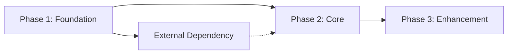

# Roadmap: [Project Name]

<!--
Project Roadmap
Filename: artifacts/roadmap_[project].md
Owner: Architect (/architect)
Handoff to: All personas as needed
Related Skills: execution-roadmaps, decomposing-tasks, estimating-work, agile-methodology
-->

## Overview

**Status:** Active | Planning | Completed
**Owner:** [Name]
**Last Updated:** [YYYY-MM-DD]
**Beads Issue:** [bd://issue-id or N/A]
**Timeline:** [Start Date] - [End Date]

## Vision

[One paragraph describing the end-state vision for this project]

## Goals

| Goal | Key Result | Status |
|------|------------|--------|
| [Goal 1] | [Measurable outcome] | Not Started |
| [Goal 2] | [Measurable outcome] | Not Started |
| [Goal 3] | [Measurable outcome] | Not Started |

## Phases

### Phase 1: [Name] (Foundation)

**Timeline:** [Start] - [End]
**Status:** Not Started | In Progress | Complete

**Deliverables:**
- [ ] [Deliverable 1]
- [ ] [Deliverable 2]
- [ ] [Deliverable 3]

**Dependencies:** None

**Risks:**
- [Risk 1]

---

### Phase 2: [Name] (Core Features)

**Timeline:** [Start] - [End]
**Status:** Not Started | In Progress | Complete

**Deliverables:**
- [ ] [Deliverable 1]
- [ ] [Deliverable 2]
- [ ] [Deliverable 3]

**Dependencies:** Phase 1 complete

**Risks:**
- [Risk 1]

---

### Phase 3: [Name] (Enhancement)

**Timeline:** [Start] - [End]
**Status:** Not Started | In Progress | Complete

**Deliverables:**
- [ ] [Deliverable 1]
- [ ] [Deliverable 2]
- [ ] [Deliverable 3]

**Dependencies:** Phase 2 complete

**Risks:**
- [Risk 1]

---

## Milestones

| Milestone | Target Date | Status | Notes |
|-----------|-------------|--------|-------|
| [Milestone 1] | [Date] | Pending | |
| [Milestone 2] | [Date] | Pending | |
| [Milestone 3] | [Date] | Pending | |
| [Launch] | [Date] | Pending | |

## Resource Allocation

| Phase | Engineering | Design | Product | QA |
|-------|-------------|--------|---------|-----|
| Phase 1 | [X FTEs] | [X FTEs] | [X FTEs] | [X FTEs] |
| Phase 2 | [X FTEs] | [X FTEs] | [X FTEs] | [X FTEs] |
| Phase 3 | [X FTEs] | [X FTEs] | [X FTEs] | [X FTEs] |

## Dependencies

### Dependency Diagram

<!--
Use Mermaid for complex dependency visualization.
ASCII diagram provided for quick reference.
-->

```
Phase 1 ──────┬──────→ Phase 2 ──────→ Phase 3
              │
              └──────→ [External Dependency]
```

<details>
<summary>Mermaid Diagram (for complex roadmaps)</summary>



</details>

| Dependency | Owner | Status | Risk Level |
|------------|-------|--------|------------|
| [Dep 1] | [Team] | [Status] | [L/M/H] |
| [Dep 2] | [Team] | [Status] | [L/M/H] |

## Risks & Mitigations

<!--
Risk Score = Probability × Impact (L=1, M=2, H=3)
- Score 1-2: Monitor
- Score 3-4: Active mitigation required
- Score 6-9: Escalate immediately
-->

| Risk | Probability | Impact | Score | Mitigation | Owner |
|------|-------------|--------|-------|------------|-------|
| [Risk 1] | [L/M/H] | [L/M/H] | [1-9] | [Strategy] | [Name] |
| [Risk 2] | [L/M/H] | [L/M/H] | [1-9] | [Strategy] | [Name] |

## Communication Plan

| Audience | Frequency | Channel | Content |
|----------|-----------|---------|---------|
| Stakeholders | Weekly | Email | Status update |
| Team | Daily | Standup | Progress/blockers |
| Executives | Bi-weekly | Meeting | Milestone review |

## Success Criteria

### Launch Readiness

- [ ] All Phase 1-3 deliverables complete
- [ ] Performance benchmarks met
- [ ] Security review passed
- [ ] Documentation complete
- [ ] Support team trained

### Post-Launch

| Metric | Baseline | Target | Actual |
|--------|----------|--------|--------|
| [Metric 1] | [Value] | [Value] | TBD |
| [Metric 2] | [Value] | [Value] | TBD |

## Related Documents

- [PRD](./prd_feature.md)
- [ADR](./adr_topic.md)
- [Design Spec](./design_spec_component.md)

---

## Changelog

| Date | Author | Change |
|------|--------|--------|
| [Date] | [Name] | Initial roadmap |
